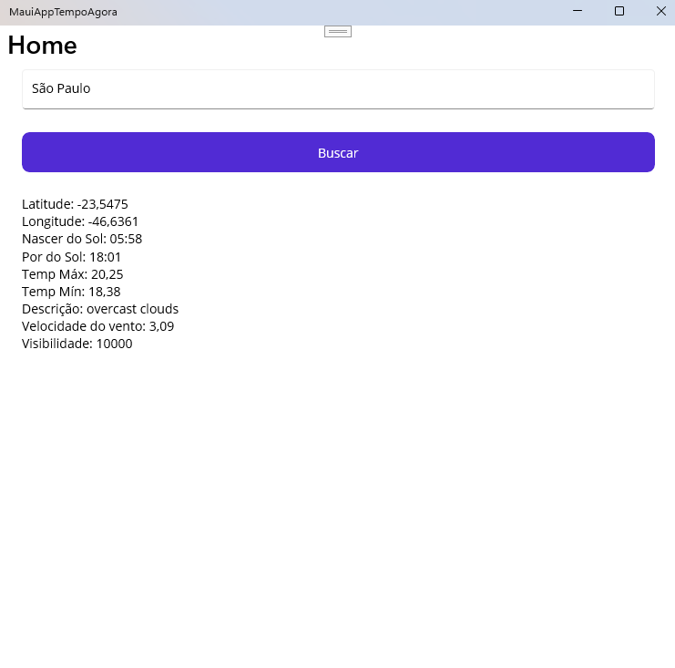
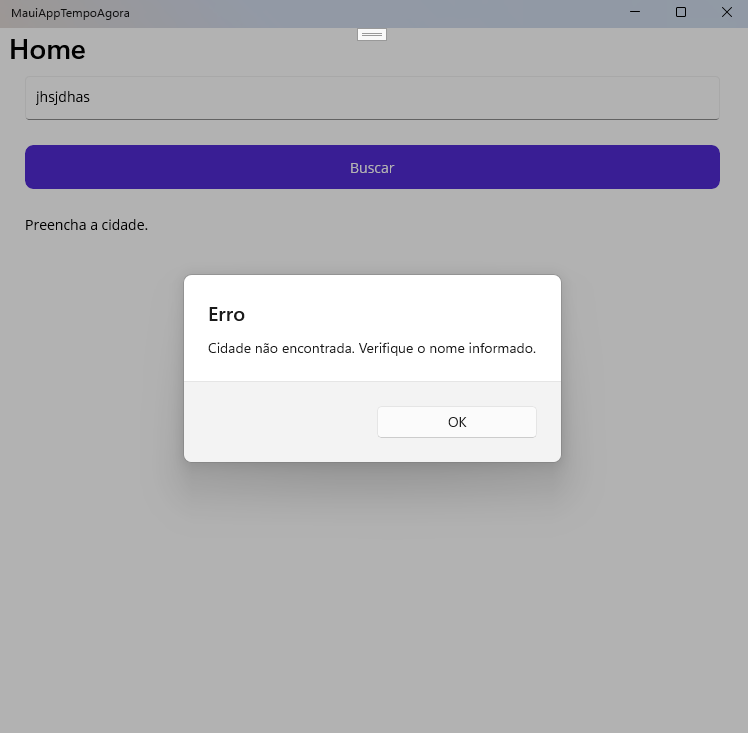

# MauiAppTempoAgora

Projeto desenvolvido para a **Agenda 07 da disciplina de Desenvolvimento de Sistemas III**, utilizando **.NET MAUI**.

O aplicativo consulta dados meteorológicos de uma cidade e apresenta informações sobre a previsão do tempo.

## Sobre a atividade

Para realizar a atividade, utilizei como base o projeto TempoAgora disponibilizado pelo meu colega Nicolas, após encontrar dificuldades para executar o projeto indicado inicialmente na Agenda 07.

A partir dessa base, analisei o funcionamento do projeto e realizei as alterações solicitadas na atividade.

## Alterações realizadas

Foram implementadas as seguintes melhorias:

- Exibição da **descrição do clima**;
- Exibição da **velocidade do vento**;
- Exibição da **visibilidade**;
- Tratamento para **cidade não encontrada**;
- Verificação e alerta para **falta de conexão com a internet**.

## Funcionamento do aplicativo

### Consulta da previsão do tempo

O aplicativo apresenta os dados da cidade pesquisada, incluindo as novas informações adicionadas durante a atividade.

### Cidade não encontrada

Quando uma cidade inexistente é informada, o aplicativo apresenta uma mensagem específica ao usuário.

### Falta de conexão com a internet

Quando não existe acesso à internet, o aplicativo informa que não foi possível realizar a consulta.

 

## Tecnologias utilizadas

- C#
- .NET MAUI
- API OpenWeatherMap
- Newtonsoft.Json
- Git e GitHub

## Autora

**Bianca Curcino**

Atividade acadêmica – Desenvolvimento de Sistemas III.
